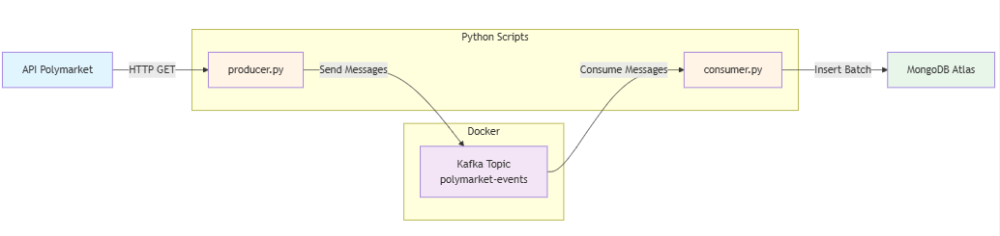

# 📊 Polymarket Data Pipeline

Pipeline de données en temps réel pour collecter les événements Polymarket via Kafka et MongoDB.

## 🏗️ Architecture

```
API Polymarket → Producer (Python) → Kafka → Consumer (Python) → MongoDB
```

### Flux de données :
1. **Producer (`producer.py`)** : Récupère les données de l'API Polymarket et les envoie à Kafka
2. **Kafka** : Message broker pour le streaming des données
3. **Consumer (`consumer.py`)** : Lit les messages depuis Kafka et les insère dans MongoDB

## 📋 Prérequis

- Python 3.8+
- Docker & Docker Compose
- Compte MongoDB Atlas (ou instance MongoDB locale)

## 🚀 Installation

### 1. Installer les dépendances Python

```bash
pip install requests kafka-python pymongo python-dotenv
```

### 2. Configuration de l'environnement

Créer un fichier `.env` à la racine du projet :

```bash
cp .env.example .env
```

Éditer le fichier `.env` avec vos propres valeurs :

```env
# API Polymarket
POLYMARKET_API_URL=https://gamma-api.polymarket.com/events

# Kafka
KAFKA_BOOTSTRAP_SERVERS=localhost:9092
KAFKA_TOPIC=polymarket-events
KAFKA_GROUP_ID=polymarket-mongo-consumer

# MongoDB
MONGO_URI=mongodb+srv://<votre-username>:<votre-password>@<votre-cluster>.mongodb.net/
DB2=polymarket_db
MONGO_COLLECTION=polymarket

# Consumer
BATCH_SIZE=100
```

### 3. Démarrer Kafka avec Docker

```bash
docker-compose up -d
```

Vérifier que Kafka est bien démarré :

```bash
docker ps
```

## 🎯 Utilisation

### Option 1 : Exécution manuelle (recommandé pour le développement)

#### Terminal 1 : Démarrer le Consumer
```bash
python consumer.py
```

Le consumer va se mettre en attente de messages depuis Kafka et les insérera automatiquement dans MongoDB.

#### Terminal 2 : Lancer le Producer
```bash
python producer.py
```

Le producer va récupérer les données de l'API Polymarket et les envoyer à Kafka. Le consumer les recevra automatiquement et les insérera dans MongoDB.

### Option 2 : Exécution en arrière-plan

#### Windows PowerShell :
```powershell
# Démarrer le consumer en arrière-plan
Start-Process python -ArgumentList "consumer.py" -NoNewWindow

# Attendre quelques secondes
Start-Sleep -Seconds 3

# Lancer le producer
python producer.py
```

#### Linux/Mac :
```bash
# Démarrer le consumer en arrière-plan
python consumer.py &

# Lancer le producer
python producer.py
```

## 📊 Monitoring

### Vérifier les topics Kafka

```bash
docker exec -it broker kafka-topics.sh --bootstrap-server localhost:9092 --list
```

### Vérifier les messages dans Kafka

```bash
docker exec -it broker kafka-console-consumer.sh --bootstrap-server localhost:9092 --topic polymarket-events --from-beginning --max-messages 10
```

### Vérifier les données dans MongoDB

Utiliser MongoDB Compass ou le shell MongoDB :

```javascript
use polymarket_db
db.polymarket.countDocuments()
db.polymarket.find().limit(5)
```

## 🛠️ Troubleshooting

### Le producer ne peut pas se connecter à Kafka

```bash
# Vérifier que Kafka est démarré
docker ps

# Redémarrer Kafka si nécessaire
docker-compose restart broker
```

### Le consumer ne reçoit pas de messages

```bash
# Vérifier que le topic existe
docker exec -it broker kafka-topics.sh --bootstrap-server localhost:9092 --list

# Vérifier les offsets du consumer group
docker exec -it broker kafka-consumer-groups.sh --bootstrap-server localhost:9092 --group polymarket-mongo-consumer --describe
```

### Erreur de connexion MongoDB

- Vérifier que `MONGO_URI` est bien configuré dans `.env`
- Vérifier que votre IP est autorisée dans MongoDB Atlas (Network Access)
- Vérifier les credentials (username/password)

## 🧹 Nettoyage

### Arrêter et supprimer Kafka

```bash
docker-compose down
```

### Supprimer les données Kafka (si volumes configurés)

```bash
docker-compose down -v
```

## 📝 Scripts disponibles

- **`producer.py`** : Récupère les données de l'API et les envoie à Kafka
- **`consumer.py`** : Consomme depuis Kafka et insère dans MongoDB
- **`PolymarketData.py`** : (Ancien script - conservé pour référence)

## ⚙️ Variables d'environnement

| Variable | Description | Valeur par défaut |
|----------|-------------|-------------------|
| `POLYMARKET_API_URL` | URL de l'API Polymarket | https://gamma-api.polymarket.com/events |
| `KAFKA_BOOTSTRAP_SERVERS` | Adresse du broker Kafka | localhost:9092 |
| `KAFKA_TOPIC` | Nom du topic Kafka | polymarket-events |
| `KAFKA_GROUP_ID` | ID du groupe de consommateurs | polymarket-mongo-consumer |
| `MONGO_URI` | URI de connexion MongoDB | - (requis) |
| `DB2` | Nom de la base de données | polymarket_db |
| `MONGO_COLLECTION` | Nom de la collection | polymarket |
| `BATCH_SIZE` | Taille du batch pour MongoDB | 100 |

## 📄 Licence

Projet éducatif - Big Data Architecture


